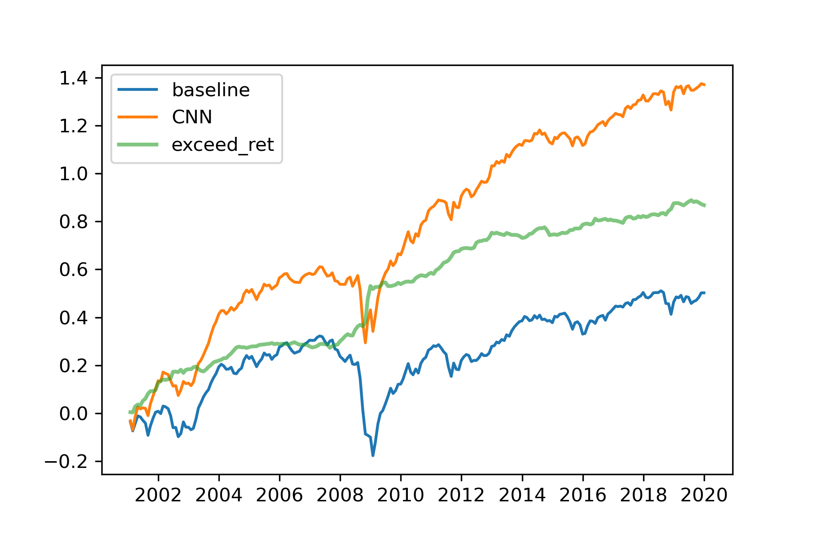
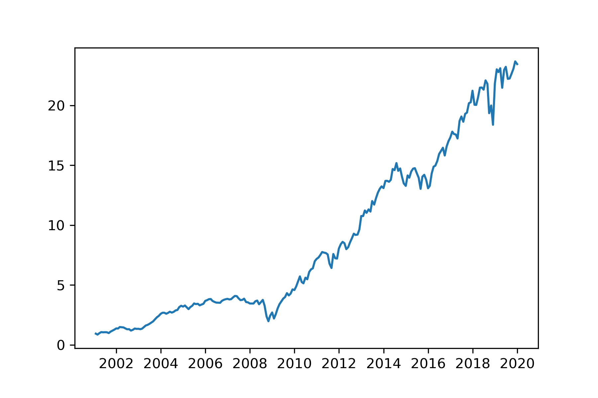

# Stock Image CNN - PyTorch Implementation [Unofficial]

This is a PyTorch implementation of [**(Re-)Imag(in)ing Price Trends**](https://papers.ssrn.com/sol3/papers.cfm?abstract_id=3756587)


# Features

- 2022/1/24: Upload pre-train model
- 2022/1/24: Support performance analysis
- 2022/1/23: Support tensorboard
- 2022/1/23: Support multi-GPU training
- 2022/1/23: Support ONNX format export

# Quickstart

The net is defined in the folder ./models, 
you can just run the notebook **train.ipynb** in ./notebooks to train and save the model.  
After training the model, you can evaluate it by **test.ipynb**.  
Here, you can see the return of the profolio built by your model.

# Performance

We choose the threshold (for the predict logit) as 0.58.  
Here shows the comparison of log return. (same weighted)
  
The accumulate return of protfolio.


# Citation

```text
Jiang, Jingwen and Kelly, Bryan T. and Xiu, Dacheng, 
(Re-)Imag(in)ing Price Trends (December 1, 2020). 
Chicago Booth Research Paper No. 21-01, 
http://dx.doi.org/10.2139/ssrn.3756587
```
